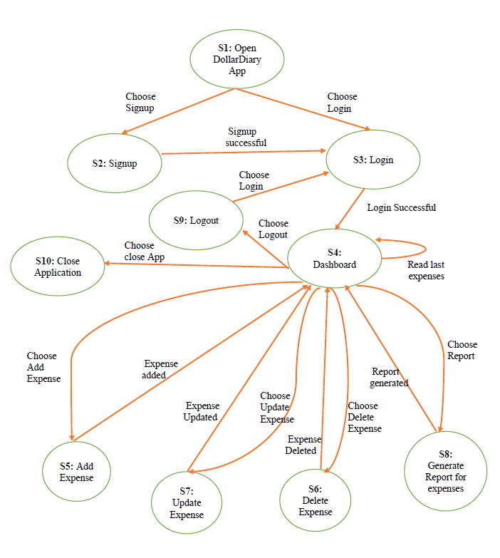

# State Transition 

## State Transition Diagram

## State Transition Table

Here is a test to cover all transitions.

| State | Event (action)           |
|-------|--------------------------|
| S1    | Choose Sign Up           |
| S1    | Choose Login             |
| S2    | Signup successful        |
| S3    | Login Successful         |
| S4    | Read last expenses       |
| S4    | Choose Add Expense       |
| S4    | Choose Update Expense    |
| S4    | Choose Delete Expense    |
| S4    | Choose Report            |
| S4    | Choose Logout            |
| S4    | Choose close App         |
| S5    | Expense Added            |
| S6    | Expense Updated          |
| S7    | Expense Deleted          |
| S8    | Report generated         |
| S9    | Choose Login             |
| S10   |           -               |

## Corresponding State Table

|           | Choose Sign Up | Choose Login | Signup Successful | Login Successful | Read Last Expenses | Choose Add Expense | Expense added | Expense Update | Choose Update Expense | Expense Deleted | Choose Delete Expense | Report generated | Choose Report | Choose Logout | Choose close App |
|-----------|----------------|--------------|-------------------|------------------|-------------------|--------------------|---------------|----------------|-----------------------|-----------------|-----------------------|-----------------|---------------|---------------|------------------|
| S1        | open DollarDiary | S2           | S3                | -                | -                 | -                  | -             | -              | -                     | -               | -                     | -               | -             | -             | -                |
| S2        | -                | -            | S3                | -                | -                 | -                  | -             | -              | -                     | -               | -                     | -               | -             | -             | -                |
| S3        | -                | -            | -                 | S4               | -                 | -                  | -             | -              | -                     | -               | -                     | -               | -             | -             | -                |
| S4        | -                | -            | -                 | -                | S4                | S5                 | -             | -              | S7                    | -               | S6                    | -               | S8            | S9            | S10              |
| S5        | -                | -            | -                 | -                | -                 | -                  | S4            | -              | -                     | -               | -                     | -               | -             | -             | -                |
| S6        | -                | -            | -                 | -                | -                 | -                  | -             | -              | -                     | S4              | -                     | -               | -             | -             | -                |
| S7        | -                | -            | -                 | -                | -                 | -                  | -             | S4             | -                     | -               | -                     | -               | -             | -             | -                |
| S8        | -                | -            | -                 | -                | -                 | -                  | -             | -              | -                     | -               | -                     | S4              | -             | -             | -                |
| S9        | -                | S3           | -                 | -                | -                 | -                  | -             | -              | -                     | -               | -                     | -               | -             | -             | -                |
| S10       | -                | -            | -                 | -                | -                 | -                  | -             | -              | -                     | -               | -                     | -               | -             | -             | -                |
