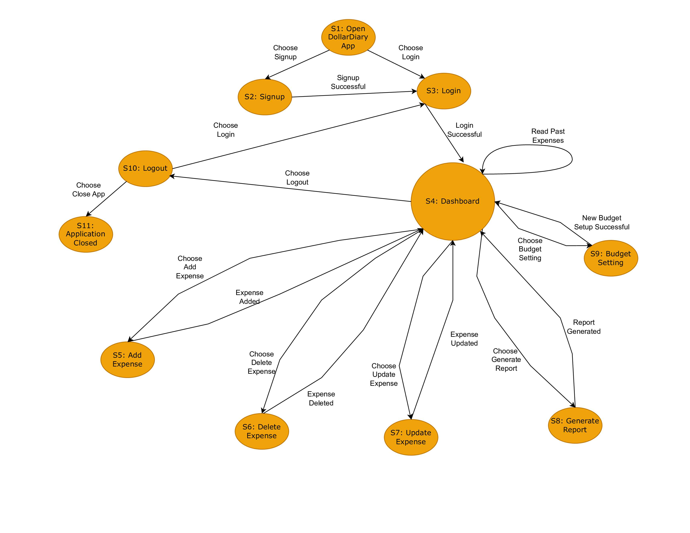

# State Transition 

## State Transition Diagram

## State Transition Table

Here is a test to cover all transitions.

| State | Event (action)          |
|-------|-------------------------|
| S1    | Choose Sign Up          |
| S1    | Choose Login            |
| S2    | Signup successful       |
| S3    | Login Successful        |
| S4    | Read Past Expenses      |
| S4    | Choose Add Expense      |
| S4    | Choose Update Expense   |
| S4    | Choose Delete Expense   |
| S4    | Choose Generate Report  |
| S4    | Choose Budget Setting   |
| S4    | Choose Logout           |
| S5    | Expense Added           |
| S6    | Expense Deleted         |
| S7    | Expense Updated         |
| S8    | Report Generated        |
| S9    | New Budget Setup Successful |
| S10   | Choose Login            |
| S10   | Choose Close App        |
| S11   | -                       |

The corresponding state table is:

| State/Event              | Choose Sign Up | Choose Login | Signup Successful | Login Successful | Read Last Expenses | Choose Add Expense | Expense added | Choose Delete Expense | Expense Deleted | Choose Update Expense | Expense Updated | Choose Generate Report | Report Generated | Choose Budget Setting | New Budget Setup Successful | Choose Logout | Choose Close App |
|--------------------------|----------------|--------------|-------------------|------------------|--------------------|--------------------|---------------|-----------------------|-----------------|-----------------------|-----------------|------------------------|-----------------|-----------------------|---------------------------|---------------|------------------|
| S1: Open DollarDiary App | S2             | S3           | -                 | -                | -                  | -                  | -             | -                     | -               | -                     | -               | -                      | -               | -                     | -                         | -             | -                |
| S2: Signup               | -              | -            | S3                | -                | -                  | -                  | -             | -                     | -               | -                     | -               | -                      | -               | -                     | -                         | -             | -                |
| S3: Login                | -              | -            | -                 | S4               | -                  | -                  | -             | -                     | -               | -                     | -               | -                      | -               | -                     | -                         | -             | -                |
| S4: Dashboard            | -              | -            | -                 | -                | S4                 | S5                 | -             | S6                    | -               | S7                    | -               | S8                     | -               | S9                    | -                         | S10           | -                |
| S5: Add Expense          | -              | -            | -                 | -                | -                  | -                  | S4            | -                     | -               | -                     | -               | -                      | -               | -                     | -                         | -             | -                |
| S6: Delete Expense       | -              | -            | -                 | -                | -                  | -                  | -             | -                     | S4              | -                     | -               | -                      | -               | -                     | -                         | -             | -                |
| S7: Update Expense       | -              | -            | -                 | -                | -                  | -                  | -             | -                     | -               | -                     | S4              | -                      | -               | -                     | -                         | -             | -                |
| S8: Generate Report      | -              | -            | -                 | -                | -                  | -                  | -             | -                     | -               | -                     | -               | -                      | S4              | -                     | -                         | -             | -                |
| S9: Budget Setting       | -              | -            | -                 | -                | -                  | -                  | -             | -                     | -               | -                     | -               | -                      | -               | -                     | S4                       | -             | -                |
| S10: Logout              | -              | S3           | -                 | -                | -                  | -                  | -             | -                     | -               | -                     | -               | -                      | -               | -                     | -                         | S11           | -                |
| S11: Application Closed  | -              | -            | -                 | -                | -                  | -                  | -             | -                     | -               | -                     | -               | -                      | -               | -                     | -                         | -             | -                |
